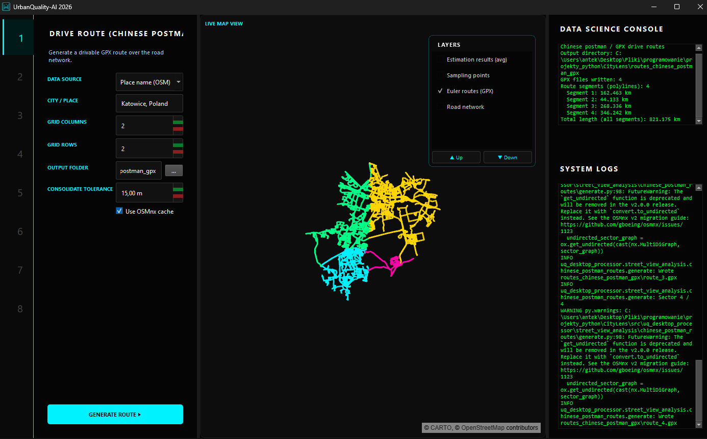
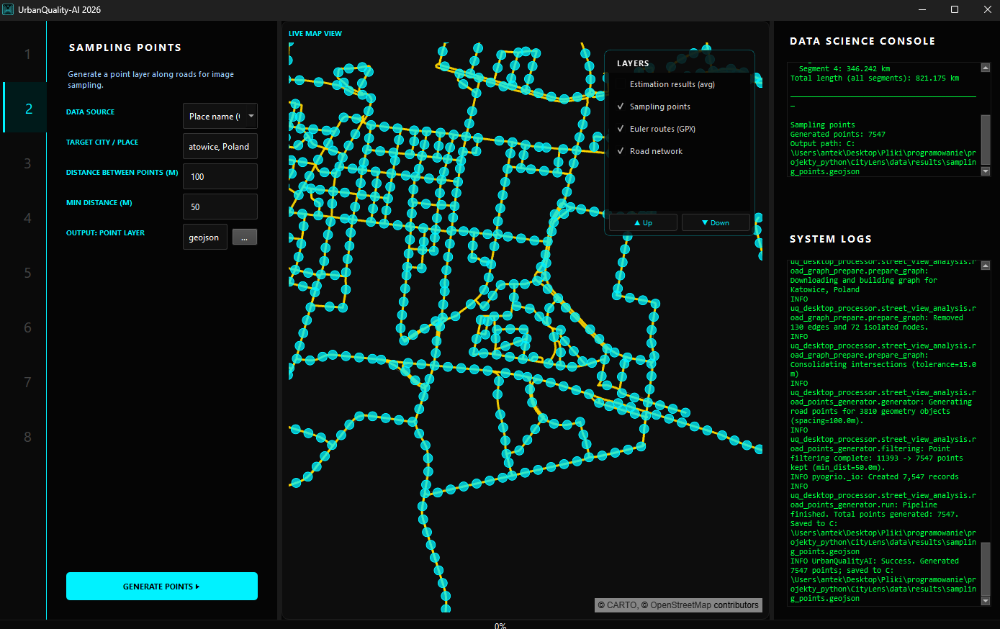
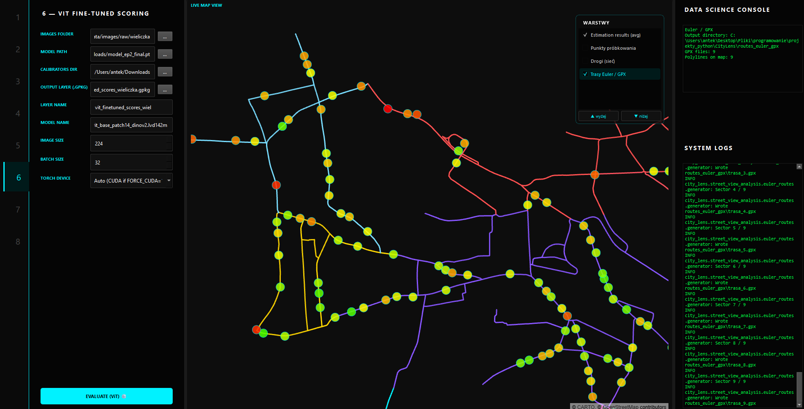

# UQ Desktop Processor

**uq-desktop-processor** is a desktop application and Python library for **visual urban assessment** from **street-level imagery**. It combines road-network sampling, optional **Mapillary** downloads (or your own photos), **CLIP**-based prefiltering and prompt scoring, optional **ViT** workflows, and export to **GeoJSON**, **GPKG**, and other GIS-friendly formats. A **drive-route / GPX** helper supports planning efficient coverage for field collection.


The installable package is **`uq_desktop_processor`** (`pyproject.toml`); import and module path are **`uq_desktop_processor`**.

**Run the app:** `python -m uq_desktop_processor` or `poetry run uq_desktop_processor` (console script: `uq-desktop-processor`).

---

## Features

- **Chinese postman / drive routes** — Cleaned Eulerian routes and **GPX** export for drive-based data collection.
- **Road-based sampling** — Points along the network with configurable spacing and minimum separation.
- **Imagery** — Batch download near sampling points via the Mapillary API, or use a folder of your own images.
- **CLIP prefilter** — Move low-relevance frames to a `rejected` folder using thresholded semantic similarity.
- **CLIP scoring** — Per-image scores on configurable axes (e.g. beauty, safety, wealth) via text prompts; aggregated summaries for GIS export.
- **ViT / finetuned scoring** — Evaluation path for vision transformer models where configured (see GUI and `evaluation/finetuned_evaluator`).
- **GIS export** — GeoJSON and GPKG / SHP / Parquet via GeoPandas.

---

## Stack

| Area | Notes                                                                                               |
|------|-----------------------------------------------------------------------------------------------------|
| **Runtime** | Python 3.12–3.14, PyTorch (CPU or CUDA), OpenAI **CLIP** (git dependency), **timm** (ViT backbones) |
| **Geo** | GeoPandas, Shapely, pyproj, Fiona, pyogrio, OSMnx                                                   |
| **Imaging** | Pillow, OpenCV (headless), piexif, py360convert                                                     |
| **Desktop** | PySide6, pydeck (map views)                                                                         |
| **Tooling** | Poetry, MkDocs, pre-commit (Black, Ruff, mypy), GitHub Actions (CI/CD)                              |

---

## Mapillary API token

For Mapillary downloads, **uq-desktop-processor** needs a **Mapillary access token**.

You can provide the token directly in the GUI token field, or use environment variable.

**PowerShell**

```powershell
$env:MAPILLARY_ACCESS_TOKEN = "YOUR_TOKEN_HERE"
```

**Bash**

```bash
export MAPILLARY_ACCESS_TOKEN="YOUR_TOKEN_HERE"
```

The app reads `MAPILLARY_ACCESS_TOKEN` by default.

---

## Installation

### Poetry (recommended)

CLIP is installed from Git; Poetry resolves this reliably.

```bash
poetry install
poetry run uq_desktop_processor
```

### pip (editable install)

```bash
python -m venv .venv
.venv\Scripts\activate   # Windows
# source .venv/bin/activate  # Linux / macOS

pip install --upgrade pip
pip install -e .
python -m uq_desktop_processor
```

If `pip` cannot install Git-hosted dependencies, install [Git](https://git-scm.com/) or use Poetry.

---

## Usage

### GUI (default)

```bash
poetry run uq_desktop_processor
# or: python -m uq_desktop_processor
```

### GUI screenshots

<p align="center">
  
</p>

<p align="center">
  
</p>

<p align="center">
  
</p>

---

## Data layout (default)

By default, **uq-desktop-processor** uses `data/` as its working directory (configurable in the GUI or pipeline config):

```
data/
├── images/
│   ├── raw/        # downloaded or linked imagery
│   └── rejected/   # prefilter rejects
└── results/
    ├── sampling_points.geojson
    └── urban_quality_ai_output.geojson
```

---

## Repository layout

```
uq-desktop-processor/
├── src/uq_desktop_processor/
│   ├── __main__.py              # GUI entry
│   ├── pipeline/                # UrbanQualityAIPipeline, defaults, CLI runner
│   ├── evaluation/              # CLIP prefilter / evaluator, finetuned evaluator, shared utils
│   ├── layer_creation/          # vector export (GeoJSON, GPKG, …)
│   ├── street_view_analysis/    # sampling, Mapillary, road graph, GPX / postman routes
│   └── gui/                     # PySide6 shell, map view, module pages
├── docs/                        # MkDocs sources
├── tests/
├── mkdocs.yml
├── pyproject.toml
└── README.md
```

---

## Documentation

```bash
mkdocs serve    # http://127.0.0.1:8000
mkdocs build    # output in site/
```

---

## Development

```bash
poetry run pytest
poetry run mypy src/
poetry run ruff check .
poetry run black --check .
pre-commit run --all-files
```
